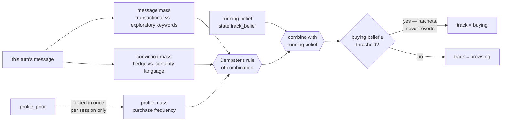
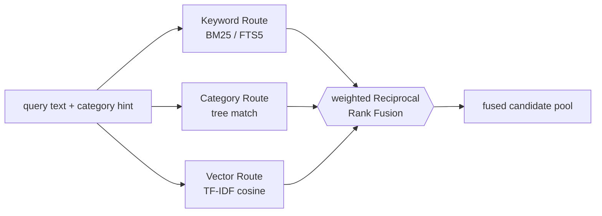
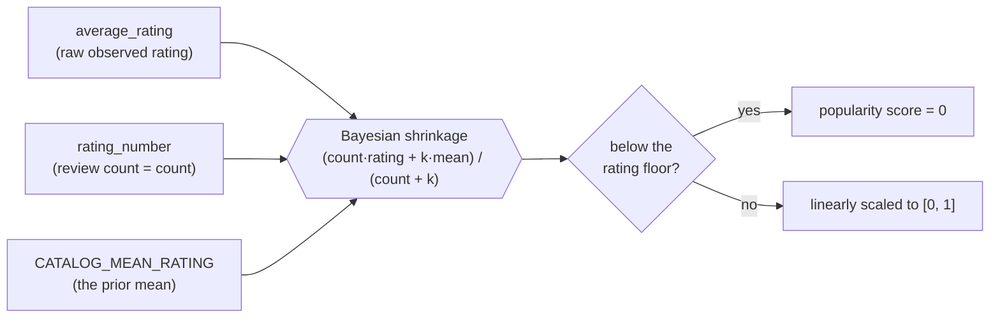
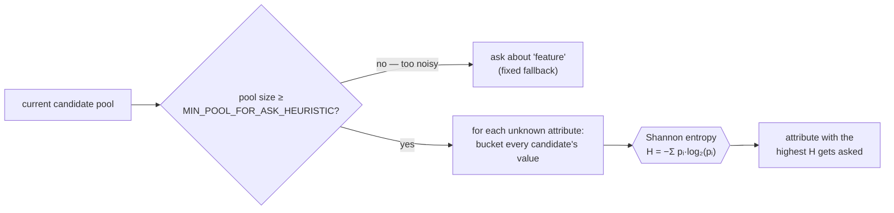

# Scoutie

**TikTok TechJam 2026 — Track 4: Conversational Shopping Agent**

Scoutie is a decision-making engine — the brain behind a shopping agent. Given a hidden purchase target somewhere in a frozen 50,000-product Amazon catalog, it gets ten conversational turns to find it, through natural conversation, structured attribute questions, and ranked recommendations, and is scored automatically on **Hit Rate@10**, **MRR**, and **MTTC**.

**This repository is the brain or the engine behind Scoutie, not a finished consumer product.** There's no onboarding flow, account system, or storefront here. Everything a real shopping app would wrap around this (chat UI, checkout, a mobile client) is a separate, later problem; this is the brain that would sit underneath it. The one exception is an optional Flask dashboard (more on that below) — that's a debugging window into the engine for a human to around, not a product in its own right.

| Metric | Description | Starter baseline | Scoutie |
|---|---|---|---|
| **Hit Rate@10** | Did the right product ever land in the top 10 recommendations, at any point in the conversation? | 0.125 | **0.945** |
| **MRR** | When it did land, how close to the #1 spot was it? (1.0 = always ranked first) | 0.068034 | **0.594772** |
| **MTTC** | On average, how many conversational turns did it take to get there? *(lower is better)* | 9.81 | **2.85** |
| **Technical Score** | The organizer's single blended ranking number — 50% Hit Rate + 30% MRR + 20% turn-efficiency | 0.10671 | **0.813932** |

For a more detailed breakdown of Scoutie's output across all metrics:
| Scenario            | Starter → Scoutie Hit@10 | Starter → Scoutie MRR | Starter → Scoutie MTTC |
| ------------------- | -----------------------: | --------------------: | ---------------------: |
| **Boundary**        |            0% → **100%** |         0 → **0.774** |           11 → **3.2** |
| **Browsing**        |        2.5% → **96.25%** |    0.0045 → **0.548** |       10.75 → **2.64** |
| **Buying**          |      23.75% → **93.75%** |     0.127 → **0.579** |        8.63 → **2.45** |
| **Intent Override** |         13.33% → **90%** |     0.104 → **0.702** |       10.07 → **4.37** |

*(200-session public dev set; see [Steps to reproduce](#steps-to-reproduce-results). Per-scenario breakdown — buying / browsing / intent override / boundary — is written into every evaluator output under `scenario_metrics`.)*

Every session hands Scoutie the same constraint a real shopper's patience hands any assistant: a hard 10-turn budget, where every clarifying question spends a turn and every guess is free. The actual design problem here was never language understanding — it's deciding, turn by turn, whether to ask or to gamble on a guess, under a budget that punishes hesitation as hard as it punishes carelessness. Everything below is built around that one tension.

## How it thinks

Five frameworks, each independently verified against the real evaluator before the next one was built on top of it. Numbers below are `recommended_technical_score` deltas, pulled from the project's own run history, not estimates.

### 1. Dual-track routing — Dempster–Shafer evidence combination

Every turn, Scoutie has to decide whether the conversation is **Buying** (lock in hard constraints, filter aggressively) or **Browsing** (stay diverse, don't over-commit). Three independent pieces of evidence feed that call: what this turn's message sounds like, what the shopper's profile prior already suggests, and how hedged or certain the phrasing is ("maybe, kind of" vs. "definitely, has to"). These get represented as belief masses over Θ = {buying, browsing} and combined with **Dempster's rule of combination**, not averaged.



**The reason**: averaging silently cancels out disagreement. A profile that says "frequent buyer" against a message that sounds like idle browsing shouldn't quietly settle into "medium confidence" — it should register as genuine uncertainty, which a Dempster-Shafer combination preserves and a plain weighted average erases. Once a session commits to "buying," a ratchet keeps it there — it never reverts, even if later language sounds vague.

### 2. Multi-route retrieval — three scorers that don't agree, fused by rank

No single retrieval strategy covers a 50,000-product catalog well on its own, so three independent, purpose-built routes run every turn and get combined:

| Route | Technique | Catches |
|---|---|---|
| **Keyword** | BM25 via SQLite FTS5, field-weighted (title × 6, features × 4, …) | exact and near-exact term matches |
| **Category** | Rule-based match against the disclosed category path | structural fit — the right department, not just the right words |
| **Vector** | Hand-rolled TF-IDF cosine similarity over a sparse inverted index | lexical-semantic overlap beyond exact terms, with no neural model involved |



The three routes almost never agree on a numeric score — BM25 and cosine similarity don't live on the same scale, so averaging them directly would be quietly wrong. **Reciprocal Rank Fusion** sidesteps the problem by only ever looking at *where* a route placed a candidate, never *how much* it liked it:

```
score(d) = Σ_route  weight_route / (RRF_K + rank_route(d))
```

Per-track route weights (Buying trusts keyword/category more; Browsing leans further on vector) were swept and held-out validated, not hand-guessed. Re-sweeping route weights against RRF alone moved the score **+0.0155**; letting Dempster-Shafer drive which weight set applies added another **+0.0139** on top.

### 3. Deterministic ranking — a weighted scorer, then a hard-constraint guarantee

Once the pool is fused and truncated, every remaining candidate is scored on four independent, normalized-to-[0,1] signals — the fused retrieval rank; a decay-weighted measure of how many of the shopper's *stated* preferences it actually **matches** (not just doesn't contradict); fit against the shopper's known profile tags; and a **Bayesian-shrunk** popularity score, where a thinly-reviewed 5-star product gets pulled back toward the catalog's mean rating and a well-established one barely moves. Wiring this blend in took the score from 0.6547 to 0.6927 (**+0.0380**).

Immediately after, a second, unconditional pass — `guarantee_pass` — takes whatever order that scorer produced and boosts every candidate satisfying *every* stated hard constraint above every candidate that violates *any* of them, full stop, regardless of score. This may not be the most innovative step out there and that's the point: it's the one place "provably correct" is checkable at all, so it doesn't get to lose to a heuristic. Grading that boost by how many constraints a candidate *confirms* (not just a binary satisfy/violate split) added another **+0.0094**.



### 4. Constraint-satisfaction understanding

Every stated hard constraint narrows the candidate domain the way a constraint narrows a CSP search space — a candidate survives only if it matches all of them. Two shapes of that domain are treated as distinct, handled conditions instead of silent edge cases: a domain still large (>20 candidates) is flagged **Over-Generality**; one nearly collapsed (<3) is a Constraint Collision.

The one guardrail that matters more than any of the math: **only explicitly stated constraints ever filter a candidate out.** A profile-guessed color or an inferred preference nudges ranking softly, later — never veto power — because an aggressive hard filter here is the single easiest way this module could silently remove the real purchase target before it's ever scored.

### 5. Turn-aware orchestration — the 20-questions problem, solved with entropy

Two decisions get made every turn, independent of each other: whether to ask a clarifying question, and what to recommend *right now*. Since there's no scoring penalty for a guess that misses and real upside if it happens to land, recommendations get populated on **every** turn, asking or not — the single biggest lever on turn-efficiency in the whole system, and the one piece here with no "smarter" version to build toward.

The ask/guess call itself runs on a flat turn cap: while `turn_count < ASK_TURN_CAP` (7) and at least one askable attribute is still unknown, Scoutie asks; once either condition fails, it guesses for the rest of the session. A track-conditional version of this cap — biasing Buying toward asking longer and Browsing toward guessing sooner — was built and evaluated, but reverted.


*Which* attribute to ask about, when asking wins, is where this gets genuinely interesting: every unknown attribute's value distribution across the current candidate pool gets scored by its **Shannon entropy**,

```
H = − Σ pᵢ · log₂(pᵢ)
```

and Scoutie asks about whichever attribute has the most information to give up — the same information-gain principle behind a decision tree's split-selection rule, applied one question at a time instead of building a whole tree up front. It's also, plainly, the single biggest one-line win in this project's history: replacing an earlier `sqrt(pool size)` heuristic with real entropy moved the score from 0.5588 to 0.6547 in one round — **+0.0959**, the largest jump anywhere in the progress log.

## The engine has no LLM in it — on purpose

Every decision above — the track, the survivors, the next question, the final order — comes from deterministic, auditable logic: evidence combination, constraint satisfaction, information-theoretic scoring, weighted arithmetic. No call to any external API, no local language model anywhere in the reasoning path.

That's a considered decision, not a workaround:

- **Auditability.** Every recommendation traces back to a specific, inspectable rule — a matched constraint, a fused rank, an entropy calculation — never a black-box completion. When a recommendation is wrong, you can point at exactly why.
- **Zero inference cost, zero latency tax.** The whole decision path runs in milliseconds, in-memory. It doesn't get slower or pricier as traffic grows, and it never queues behind a rate limit.
- **It doesn't go down.** No API outage, no model deprecation, no silent behavior drift from a provider-side update. What it does today is what it does next year, unless the code changes.
- **Reproducibility.** Same input, same output, every time — which is what makes the round-by-round scoring history above a meaningful signal instead of noise.

None of this means a language model has no future place near Scoutie — it means the **decision layer and the conversation layer are separable**, and keeping them separate is the feature, not a limitation. See below for where that split could go.

## Limitations, and where this goes next

### The honest gaps, today

- **The "vector" route isn't semantic.** `VectorRoute` is TF-IDF cosine over a sparse index — lexical underneath, on purpose, to stay clear of any local-model question. A genuine paraphrase that shares no vocabulary with the catalog text ("something to keep my hands warm" → gloves) will lose to a real embedding route. The highest-leverage single upgrade left on the table.
- **The constraint engine filters flatly; it doesn't propagate.** Real arc-consistency (AC-3) — relaxing exactly the right constraint first when two stated constraints jointly empty the domain — was designed, population-checked, and **left unbuilt**: it would change internal state on a real fraction of turns but had zero path to affecting any scored metric on this dataset. That calculus could look different on a larger, more constraint-dense private set.
- **Thresholds were evaluator-driven, not systematically searched.** Every constant in `config/thresholds.py` was set by running the real evaluator and, for tunable weights, checking against a held-out slice — real discipline, but still 200 sessions, not a proper grid or evolutionary sweep across a larger split.
- **Belief revision overwrites; it doesn't formally revise.** Intent Override replaces a slot's value outright rather than running AGM-style contraction-before-expansion. A more formal version was built and evaluated — and reverted, because the added complexity didn't earn its keep.
- **Always-recommending is optimal for this scoring formula, not free in general** — a limitation worth naming. None of the three scored metrics penalizes a bad guess (Hit Rate@10 only checks whether the target ever lands in a turn's top 10, MRR only scores the rank at the turn it actually hits, MTTC only counts turns elapsed until then), so recommending on every turn is a strictly dominant strategy in expectation — zero downside on a miss, pure upside on a hit — but that's a property of this competition's scoring formula, not a universal shopping-UX truth.
- **No dialogue summarization.** Context handed to retrieval is the last few raw turns, joined as-is. Untested at scale, since sessions here rarely run long enough to expose it.

### Where this could grow

**A live, expanding catalog.** The catalog is frozen by the competition's own design — every retrieval index is built once at `Agent()` construction and reused for the whole run. Turning that into a real product means incremental index updates instead of a full rebuild per catalog change, which is a genuinely different (and harder) systems problem than anything solved here.

**Persistent, cross-session taste — fed by the platforms a shopper already curates on.** Right now, `profile_prior` — the seed that biases track fusion and ranking toward a shopper's known taste — is handed in once per session and forgotten the moment it ends; there's no memory across conversations, by explicit competition scope. The natural next step is turning that single-session seed into a persistent, evolving model: with clear user consent, periodically ingesting signals a shopper has already generated elsewhere — saved Pinterest boards, TikTok likes, saves, and Shop engagement — and distilling them into the same shape `profile_prior` already expects, so the *existing* extension points do the work instead of a new system bolted on. `track_fusion.py`'s `_profile_mass()` would already know a browsing-shaped message from a shopper whose boards are full of one category; `rank.py`'s `profile` term would already know what "matches this shopper's taste" means before they've typed a word. The actually interesting engineering problem isn't the ingestion pipeline — it's deciding how much a two-year-old saved pin should still count, which is the same decayed-evidence problem `SLOT_DECAY_RATE` already solves at the single-session scale (§5, above), just stretched across months instead of turns.

**A generative layer, at the surface only.** If a language model ever joins this system, the architecture above argues for where it belongs: paraphrasing questions, warming up small talk — never deciding what to filter, ask, or rank. The judgment stays governed by the deterministic core above; only its voice would change.

## Setup and installation instructions

**Requirements:** Python 3.9+, pip.

```bash
git clone <this-repo-url>
cd Scoutie

python3 -m venv venv
source venv/bin/activate        # Windows: venv\Scripts\activate

pip install -r requirements.txt   # numpy, flask
```

The frozen catalog, the local evaluator, and the starter baseline agent are the organizer's
participant kit (see [Repository layout](#repository-layout) below for exactly what goes where) —
already public, not our IP, and the catalog alone is 60MB+, so they're `.gitignore`d rather than
committed. Download the
[participant kit release](https://github.com/TechJam2026/techjam-conversational-search/releases/tag/participant-kit)
and unpack `data/`, `evaluator/`, and `starter/` at the repo root. That's the whole setup —
everything else (`scoutie/`) is this submission's own code and is already in the repo.

## Steps to reproduce results

**1. Reproduce the starter baseline** (the floor every change is measured against):

```bash
python -m evaluator.local_evaluator
```

Runs the organizer's own BM25 starter agent against all 200 public sessions and writes
`results.json`. Expect `hit_rate_at_10: 0.125`, `mrr: 0.068034`, `recommended_technical_score:
~0.1067`.

**2. Reproduce Scoutie's score:**

```bash
python -m scoutie.evaluation.run_ablation --label my_run
```

Runs the identical evaluator against `scoutie.agent.Agent` and saves a labeled, timestamped
snapshot to `results/my_run_<timestamp>.json` (gitignored locally — internal development evidence,
not part of this snapshot, so a fresh clone starts with it empty). You should see numbers matching the table at the
top of this README. Per-scenario metrics (buying / browsing / intent_override / boundary) are
under the `scenario_metrics` key in that same JSON.


**Optional live demo:** a Flask chat UI wraps this same engine (no code path swapped, same
scoring behavior) at [`http://54.86.160.215:5050`](http://54.86.160.215:5050) — a window into the
engine for a human to try, not the graded artifact.
```bash
python -m scoutie.dashboard.api    # serves on :5050; set PORT to override
```

Then open `http://localhost:5050`.

## Repository layout

Two things live in this repo: **the Scoutie Engine** (`scoutie/` — everything this submission
actually built) and **the organizer's participant kit** (`data/`, `evaluator/`, `starter/` — not
committed, see Setup above).

### The Scoutie Engine (`scoutie/`)

```
scoutie/
├── agent.py                    Entry point — Agent.reset() / Agent.respond(), the only
│                                 thing the evaluator ever calls. Thin: it wires the
│                                 modules below together; no real logic lives here.
├── state.py                    SessionState — the single source of truth for one
│                                 conversation (slots, track, candidate pool, history).
├── text_utils.py               Vendored parsing helpers, owned outright by this repo.
├── config/
│   └── thresholds.py           Every tunable number, in one place.
│
├── understanding/              → decides what the conversation actually means
│   ├── track_fusion.py           Buying vs. Browsing — Dempster–Shafer (§1)
│   ├── belief_revision.py        Slot state, Intent Override handling
│   └── constraint_engine.py      Hard-constraint filtering, domain-size checks (§4)
│
├── retrieval/                  → finds candidates
│   ├── routes.py                 KeywordRoute · CategoryRoute · VectorRoute (§2)
│   ├── fusion.py                 Weighted Reciprocal Rank Fusion (§2)
│   └── precision_pass.py         Pool truncation + category rescue
│
├── ranking/                    → orders candidates
│   ├── rank.py                   Deterministic weighted scorer (§3)
│   └── guarantee_pass.py         Hard-constraint boost pass (§3)
│
├── strategy.py                 → decides what to do this turn — ask vs. guess,
│                                  which attribute, Shannon-entropy selection (§5)
│
├── evaluation/
│   └── run_ablation.py         Runs the real evaluator against this engine
│
└── dashboard/                  Optional live demo — not part of the scored path
    ├── api.py                    Flask server wrapping Agent
    ├── catalog_ingest.py         Seller CSV → catalog conversion
    ├── humanizer.py              Templated natural-language replies for the chat UI
    ├── live_adapter.py           Live message ↔ Agent contract adapter
    └── static/                   The chat UI itself
```

*(§ references point back to [How it thinks](#how-it-thinks) above.)*

### The organizer's kit (gitignored)

```
data/          catalog.jsonl (50,000 products) · public_set.jsonl (200 dev sessions)
evaluator/     local_evaluator.py — scores Hit Rate@10 / MRR / MTTC
starter/       the unmodified BM25 baseline agent, for comparison
docs/          other files on competetion spec, deliverable etc.
```
